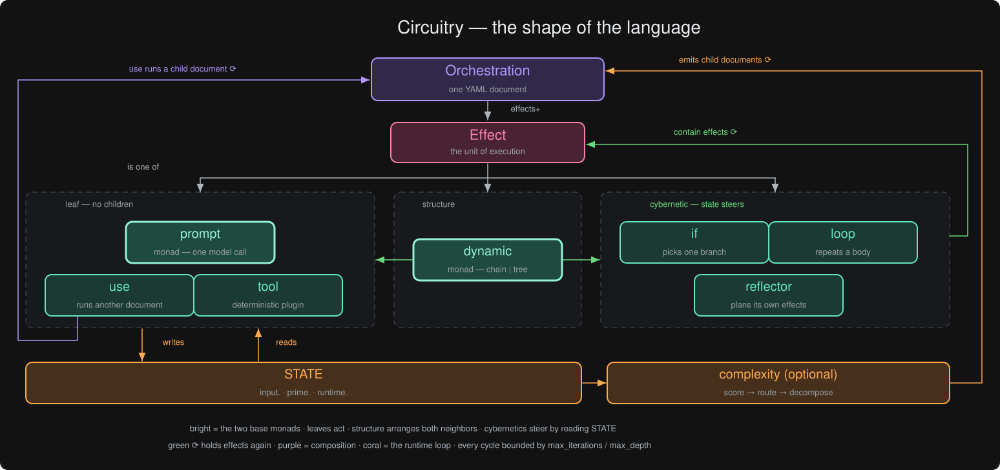

# Circuitry

[](https://pypi.org/project/circuitry-cof/)
[](https://github.com/kenankstipek/circuitry/actions/workflows/quality.yml)
[](https://github.com/kenankstipek/circuitry)
[](LICENSE)

**Circuitry** (CLI: `cof`) is the **C**ybernetic **O**rchestration **F**ramework — a YAML-first runtime for LLM pipelines that observe their own output and adapt. Loops re-evaluate continuation against what the model just produced, conditionals branch on accumulated state, and reflectors plan from observed results. It's a closed-loop control system for model invocations, not a chain of static prompts. The design draws on the cybernetics of [Gordon Pask](https://en.wikipedia.org/wiki/Gordon_Pask): a run is effects in conversation with each other through state — a system in conversation with itself about what to do next.

> "Control mechanisms that lay their own plans." — Gordon Pask, *An Approach to Cybernetics* (1961)

An orchestration is exactly that: a declared control mechanism which, through reflectors and decomposition, lays its own plans.

This README follows that arc in three acts: **[Basics](#basics--the-machine)** is the machine, **[Cybernetics](#cybernetics--the-machine-steering-itself)** is the machine steering itself, **[Complexities](#complexities--the-machine-in-the-world)** is the machine in the world. Each section assumes only the ones before it.

<!-- DEMO_GIF: replace with an asciinema or terminal-recorded GIF showing `cof run hello` and one looped orchestration -->

## Install

One-line install via pipx (isolated, no virtual env needed):

```bash
curl -fsSL https://raw.githubusercontent.com/kenankstipek/circuitry/main/scripts/install.sh | sh
```

Or install manually:

```bash
pipx install circuitry-cof              # PyPI (once published)
pipx install git+https://github.com/kenankstipek/circuitry.git   # Latest from main
```

Or for development:

```bash
pip install -e .
```

This gives you the `cof` command. The Python import name is `circuitry` (`from circuitry import run_orchestration`); the PyPI distribution name is `circuitry-cof`.

## Quick Start

```bash
# Interactive setup — detects backends, creates config
cof setup

# Browse available orchestrations (organised by category: learn, utilities, patterns, recipes, agents)
cof list

# Run by slash-delimited name (no path needed)
cof run learn/hello -e name=World

# Just the output value
cof run learn/hello -e name=World --tail

# See details for an orchestration
cof info recipes/article_summarizer

# Copy a curation entry into the working directory for editing
cof eject recipes/article_summarizer

# Initialize a new project (creates config + hello.yml)
cof init

# Or drive everything from the terminal UI
cof tui
```

### Your first orchestration

An orchestration is one YAML document: a list of effects that read each other's output through state.

```yaml
# dinner.yml
effects:
  - type: prompt
    name: dish
    template: "Suggest one main course for {{input.occasion}}."
  - type: prompt
    name: shopping_list
    template: "List the ingredients to buy for: {{prime.dish.value}}"
```

```bash
cof check dinner.yml
cof run dinner.yml -e occasion="anniversary dinner" --tail
```

`dish` writes to `prime.dish.value`; `shopping_list` reads it there. Every path is deterministic, derived from the effect's name.

### Curation library

Pre-built orchestrations live at `src/circuitry/curation/`, organised by category:

- **`learn/`** — single-primitive demonstrations (one concept per file, good first read).
- **`utilities/`** — composable, single-output orchestrations called from other orchestrations via `use:`.
- **`patterns/`** — multi-primitive composition templates (kitchen-sink, critique→refine, parallel→judge, classify→route).
- **`recipes/`** — full real-world workflows (article summarizer, comic strip, …).
- **`agents/`** — orchestrations that build or improve other orchestrations.

The `manifest.json` in that directory is the operational registry consumed by `cof list` / `cof run` / `cof info` / `cof eject`. Run `cof list` to see what's available.

## Why Circuitry?

Every framework can call a model in a loop. Here, the loop is the language: `if`, `loop`, and `reflector` are declared in the same YAML grammar as the prompts they steer, and the model can be the sensor as well as the actuator. Because the control loop is declared rather than coded, it is validated before it runs, recorded while it runs, and portable across providers after it runs — and the runtime steers itself the same way, scoring, routing, and decomposing prompts. Steering isn't a feature bolted onto a pipeline runner; it's the organizing idea.

Pick Circuitry when the topology — what runs after what, conditional on what — is the thing you want to design and read.

## Mental model



The language has exactly seven effects, and they fall into three kinds:

- **Leaf effects** — `prompt`, `tool`, `use`. They act: one model call, one plugin call, one child orchestration. They contain no other effects.
- **Structure** — `dynamic`. It always contains effects and never decides anything; it is pure composition.
- **Cybernetic effects** — `if`, `loop`, `reflector`. They read state and steer: which branch, another pass, a new plan.

Two of the seven are the base monads everything else is built from: **prompt** (one model call wrapped with its trace) and **dynamic** (composition of effects, sequential or parallel). The rest of the language is those two ideas reused at every scale — and every effect, whatever its kind, communicates the same way: it writes a value to a deterministic state path, and later effects read it there.

## Basics — the machine

A prompt here isn't a function call — input in, output out. It's a *computation that returns a value alongside a transformed context*: the value is the model's response; the context is everything around it (which adapter, how many tokens, whether it errored, what the rendered prompt actually was). `f(state) → (state', y)` — the state monad, with the prompt as its `unit`.

Two prompts raise the question of what the second knows about the first. The answer is one state object every effect writes to and reads from, each output addressable at a deterministic path derived from its name: an effect called `sear` always writes to `prime.sear.value`. Chaining prompts is monadic bind; the paths are how a step addresses what came before. And name a composition and you can reuse it — that's the dynamic, and it's everywhere: the root of every orchestration, the body of every loop, each branch of every conditional.

### Prompt

The atomic unit. One model invocation, one typed result, written to state at a deterministic path.

```yaml
- type: prompt
  name: suggest_dish
  template: "Suggest one main course for {{input.occasion}}, in one sentence."
```

State path: `prime.suggest_dish.value`

Available types: `text`, `json`, `boolean`, `number`, `array`, `object`. Structured types (`json`, `object`, `array`) require a `schema`:

```yaml
- type: prompt
  name: parse_recipe
  prompt_type: json
  schema:
    type: object
    properties:
      ingredients:
        type: array
        items:
          type: string
    required: [ingredients]
  template: "Extract the ingredient list as JSON from this recipe:\n{{input.recipe_text}}"
```

### Dynamic

A named scope that composes effects with explicit control flow topology.

```yaml
- type: dynamic
  name: menu
  flow: chain
  effects:
    - type: prompt
      name: main_course
      template: "Suggest a main course for {{input.occasion}}."
    - type: prompt
      name: wine
      template: "Pick a wine to pair with: {{menu.main_course.value}}"
```

Flow models:
- **chain** — sequential; each effect sees prior state.
- **tree** — parallel; all effects launch against the same input snapshot, so siblings cannot read each other.

### State

Every effect writes to a deterministic path derived from its name. This is what makes interpolation — and therefore cybernetic feedback — reliable.

State is a real-time graph that deterministically shadows the run. The YAML fixes the graph's shape before execution begins — every effect name is a node address — and execution fills it in, so a snapshot at any instant is the run's current truth: what completed, what it produced, which branch was taken, which pass a loop is on. `--live-state` streams the graph as it grows.

State has three root namespaces: `input` (what the caller supplied), `prime` (what effects produced), and `runtime` (what the framework recorded). Every path starts with one of the three.

```
input.<name>                                      # caller-supplied input
prime.<effect>.value                              # top-level prompt
prime.<dynamic>.<effect>.value                    # inside a dynamic
prime.<loop>.iter_<n>.<effect>.value              # a specific loop pass (post-loop)
prime.<loop>.last.<effect>.value                  # the final completed pass (post-loop)
prime.<loop>.collected.value                      # loop collect aggregation
```

Two reading languages, one namespace:

- **Mustache templates** — `{{input.occasion}}`, `{{prime.suggest_dish.value}}` inside any `template:` string (triple-stache `{{{…}}}` to skip HTML escaping).
- **CEL expressions** — `state.input.guests`, `state.prime.suggest_dish.value` inside any `expr:`. Real [CEL](https://github.com/google/cel-spec), evaluated by [cel-python](https://pypi.org/project/cel-python/): comparisons, `&& || !`, the `?:` ternary, `has()`, the comprehension macros (`all` / `exists` / `exists_one` / `map` / `filter`) and the standard functions (`size()`, `int()`, `string()`, `matches()`, …). Equality is typed the way CEL specifies it, so `1 == true` is `false`. Run `cof run learn/cel_showcase` to see each construct branch.

Inside loop bodies, two bare loop-scope bindings are also available: `{{_loop_index}}` (zero-based iteration index) and `` (current collection element, `each` loops only). See [docs/troubleshooting-state-paths.md](docs/troubleshooting-state-paths.md).

### Configuration

Capability lives in config, deliberately outside orchestration documents — documents describe *what to do*, config describes *what can do it*. Orchestrations stay portable because they never hard-wire a provider.

Resolution is layered and unsurprising — CLI flags beat `--profile` ([docs/profiles.md](docs/profiles.md)), which beats the orchestration's own settings, which beat env vars, config files, and defaults. The less usual part: where each value came from is recorded per run in `runtime.effective_settings.sources`, so every model decision is auditable after the fact.

A local-first `circuitry.config.json` looks like this — ollama serves everything by default, with per-adapter settings under `runtime.adapters`:

```json
{
  "default_adapter": "ollama",
  "default_model": "llama3.1:8b",
  "runtime": {
    "adapters": {
      "ollama": {
        "base_url": "http://localhost:11434",
        "timeout_seconds": 600
      },
      "openai": {
        "base_url": "https://api.openai.com/v1",
        "default_model": "gpt-4o-mini"
      },
      "anthropic": {
        "base_url": "https://api.anthropic.com",
        "default_model": "claude-sonnet-4-20250514",
        "max_tokens": 4096
      }
    }
  }
}
```

(`timeout_seconds: 600` is the kind of headroom a large local model needs for a cold load — see [Errors](#errors).)

Model strings are opaque to the runtime — provider model names for most adapters, capability tiers for brokers like CyberDiner.

Adapters don't have to be completion endpoints. [CyberDiner](https://github.com/KenanKStipek/CyberDiner) is a job-queue LLM broker, and its adapter hides submit-and-poll behind the same synchronous `generate()` — there, `model:` selects a capability tier (`cheap`, `fast`, `good`, …) instead of a model name, and the API token lives in config, never in orchestration YAML (credentials are resolved at run time and redacted from serialized state). See [docs/cyberdiner-demo-runbook.md](docs/cyberdiner-demo-runbook.md) and [`learn/cyberdiner_hello`](src/circuitry/curation/learn/cyberdiner_hello.yml).

### Errors

Runs degrade deliberately, never mysteriously:

- **`on_error`** — per effect: `fail` (default), `skip`, or `continue`. Loops use `fail` / `break` / `continue`.
- **`retries`** — `{max_attempts, backoff_ms}` on a prompt; each attempt is recorded.
- **`provider_fallbacks`** — an ordered list of providers to try when the primary errors; the attempt chain lands in state so you can see who actually answered.
- **Timeouts** — `timeout_ms` per effect; per-adapter socket timeouts via `runtime.adapters.<name>.timeout_seconds` in config (large local models can need cold-load headroom).

```yaml
- type: prompt
  name: pair_wine
  template: "Pick a wine to pair with: {{prime.suggest_dish.value}}"
  retries: {max_attempts: 3, backoff_ms: 500}
  provider_fallbacks: [ollama, openai]
  timeout_ms: 60000
  on_error: skip        # no sommelier tonight — dinner goes on
```

Every failure, retry, skip, and fallback is written to `runtime` — the run record tells you not just that something failed, but what the framework did about it.

## Cybernetics — the machine steering itself

> "People can even have conversations with themselves." — Gordon Pask, in *Learning Strategies and Learning Styles* (1988)

Everything above is *open-loop*: a static directed graph, decisions made at authoring time. A long chain or a wide tree can't surprise itself. What turns it into a *closed-loop* control system is two ideas — **branching on observed state** and **iterating on observed state**.

A conditional is a predicate over state — most interestingly a model-evaluated one, where the LLM is the sensor. A loop re-reads the mutated state after every pass and decides whether to continue. A monitor compares, a controller adjusts: the orchestration becomes a system that observes itself running. The framework is named for this.

### If

The system inspects its own state and selects a path.

```yaml
- type: if
  name: check_diet
  if:
    mode: cel
    expr: "state.input.diet == 'vegetarian'"
  then:
    - type: prompt
      name: main_course
      template: "Suggest a vegetarian main course for {{input.occasion}}."
  else:
    - type: prompt
      name: main_course
      template: "Suggest a main course for {{input.occasion}}."
```

Evaluation modes:
- **model** — the LLM reads state and decides the branch (cybernetic evaluation; `threshold:` tunes the confidence cut, default 0.5)
- **cel** — deterministic evaluation using CEL expressions

An unset `state.` path makes a CEL condition `false` by rule, matching the way a
template referencing a disabled node renders empty. Where that would be unsafe —
a safety gate, an order-exit rule — add `strict: true` beside `mode: cel` and an
unresolved path errors the effect instead of quietly picking a branch.

A named `if` nests its branch outputs (`prime.check_diet.main_course.value`) and records the decision; an unnamed one merges branch effects into the parent scope. Both branches use the same inner name — `main_course` — so downstream effects read one path whichever way dinner went.

### Loop

The loop body executes, writes state, and the continuation condition evaluates against that new state — each iteration's output is the next iteration's input.

```yaml
- type: loop
  name: season
  while:
    mode: model
    template: "Taste this. Does the seasoning need adjusting? Reply true or false.\n\n{{prime.adjust.value}}"
  max_iterations: 5
  body:
    - type: prompt
      name: adjust
      template: "Adjust the seasoning and describe the dish now:\n{{prime.adjust.value}}"
```

Loop modes:
- **while** — continue while the condition holds (model or CEL evaluated); always sequential.
- **each** — iterate over a collection, optionally in parallel (`flow: tree`, bounded by `max_concurrency`).

`max_iterations` (default 100) is the deliberate floor against runaway feedback. An `each.in` path that doesn't resolve to an array terminates the loop as `collection_unresolved` — never silent success.

Loops support `collect` to aggregate one body step's output across iterations:

```yaml
- type: loop
  name: courses
  each:
    in: input.menu
    as: course
  collect: cook
  body:
    - type: prompt
      name: cook
      template: "Write the cooking steps for: {{course}}"
```

Four read forms, one per question:

| You want | Path | Where |
| --- | --- | --- |
| This pass's value | `prime.cook.value` | inside the body / `while` condition |
| A specific past pass | `prime.courses.iter_2.cook.value` | after the loop |
| The final completed pass | `prime.courses.last.cook.value` | after the loop |
| Every pass of one step | `prime.courses.collected.value` | after the loop (needs `collect`) |

`last` points at the final pass that *completed* — error passes don't count — and is absent when no pass completed, so a read of it fails loudly rather than silently serving a stale value.

### Reflector

A reflector reads state and *generates* the effects it runs next, bounded by `max_iterations` and `max_effects`. Plans execute through `use(inline)`, so they pass the same schema gate as hand-written YAML. Reach for it only when the steps can't be known up front.

```yaml
- type: reflector
  name: replan_service
  max_effects: 5
  effects:
    - type: prompt
      name: propose_steps
      template: "The roast burned and guests arrive in an hour. Plan the recovery, given dinner so far: {{prime.courses.collected.value}}"
```

Each cycle starts with the **prime directive**: a planning instruction, rendered with the reflector's goal, context, and `max_effects`, that tells the planner what a plan must look like. Directives express intent and are never themselves run. Circuitry ships a versioned default; `prime_template:` replaces it.

The directive also fixes the plans' language: [ASD-STE100 Simplified Technical English](https://www.asd-ste100.org/) — one instruction per sentence, active voice, a controlled vocabulary. A narrowed output distribution makes plans predictable to validate, and small planner models sufficient to write them.

## Complexities — the machine in the world

> "Observers are men, animals, or machines able to learn about their environment." — Gordon Pask, *An Approach to Cybernetics* (1961)

What remains is the machine meeting the world: orchestrations composing orchestrations, the runtime measuring and routing its own prompts, oversized prompts decomposing themselves, and the surfaces — CLI, TUI, SDK, MCP, tools, persistence — everything else arrives through.

### Composition: `use` and `interface`

A `use` effect runs another orchestration as an isolated sub-step: the child runs in its own store, only mapped inputs pass in, only mapped outputs come back.

```yaml
- type: use
  name: sauce
  path: ./make_sauce.yml      # a sauce is a sub-recipe: its own document
  inputs:
    base: "{{prime.suggest_dish.value}}"
    style: pan
  outputs:
    sauce: {path: prime.compose.value, type: string}
```

Reference fields (exactly one):
- **`ref:`** — curation-library lookup, slash-delimited (`utilities/critique`, `recipes/article_summarizer`).
- **`path:`** — filesystem path. Absolute, cwd-relative, or parent-orchestration-relative.
- **`inline:`** — Mustache template that renders to orchestration YAML at runtime (for LLM-generated plans), schema-validated before execution (`validate:`, default `true`).

Plus `on_error:`, nesting inside loops/conditionals/dynamics, and cycle detection — validation rejects orchestration graphs that recurse on themselves.

```yaml
# LLM-generated orchestration execution
- type: prompt
  name: plan_prep
  template: "Generate a Circuitry orchestration YAML for prepping: {{input.dish}}"

- type: use
  name: run_prep
  inline: "{{prime.plan_prep.value}}"
  validate: true
```

The other half of the contract is `interface`: an orchestration declares typed inputs and outputs, and when referenced by a `use`, required inputs are validated and output mappings are auto-generated. An interface is the child's mise en place — everything it needs, laid out and named, before any heat is applied.

```yaml
# make_sauce.yml
interface:
  inputs:
    base:
      type: string
      required: true
      description: The dish the sauce accompanies.
    style:
      type: string
      required: false
  outputs:
    sauce:
      type: string
      path: prime.compose.value

effects:
  - type: prompt
    name: compose
    template: "Compose a {{input.style}} sauce for {{input.base}}."
```

`use.outputs` and `interface.outputs` take the same shape: an object per name, `path` required, `type` and `description` optional. When neither `outputs:` nor a child `interface:` declares outputs, the entire child `prime` subtree is exposed at `prime.<use_name>.<child_effect>.value`.

### Complexity: scoring and routing

The system measuring itself. Circuitry can score every prompt's difficulty deterministically — mechanical signals only, breakdown recorded at `meta.complexity` and readable from CEL — and then route each prompt to the cheapest capable model through an ordered band table. Three independent switches, all off by default:

```json
{
  "runtime": {
    "complexity": {
      "scoring": { "enabled": true },
      "routing": {
        "enabled": true,
        "respect_explicit": true,
        "bands": [
          { "name": "light", "max": 20, "model": "phi3:mini" },
          { "name": "mid",   "max": 40, "model": "qwen2.5:7b-instruct" },
          { "name": "heavy",            "model": "gpt-oss:20b" }
        ]
      }
    }
  }
}
```

Bands are ordered, `max` is inclusive, and the final band omits `max` as the required catch-all. The router only ever substitutes the run-default model: an explicit per-effect `model:` or a `--model` flag always wins (`respect_explicit`), and provenance says who decided — a routed effect records `sources.model: "router"` plus its score and band in `meta`. Per-effect profile entries can opt out (`routing: false`) or pin a band.

```bash
cof score recipes/article_summarizer          # static per-effect preview, no LLM calls
cof run recipes/article_summarizer --explain-routing
cof run recipes/article_summarizer --scoring --routing   # force-enable per run
```

See [docs/complexity-config.md](docs/complexity-config.md), [docs/routing.md](docs/routing.md), and [docs/score-command.md](docs/score-command.md).

### Prompt decomposition

Everything above, composed. "Cook Thanksgiving dinner for twelve" is too much for one prompt — and when it scores over the decomposition threshold, the runtime knows it. The prompt goes to a **planner — itself an orchestration** — which emits fan-out + merge YAML: courses that cook in parallel, and a merge that plates them. The plan is schema-validated, runs as a fully visible child via `use`, and the merged result lands at the original prompt's state path. Downstream effects never know dinner was ever in pieces.

```json
{
  "runtime": {
    "complexity": {
      "decomposition": {
        "enabled": true,
        "threshold": 45,
        "max_chunks": 5,
        "max_depth": 1,
        "on_failure": "route_up"
      }
    }
  }
}
```

- Chunks are scored too — recursion is bounded by `max_depth`.
- `on_failure: route_up` keeps runs alive: if the planner fails or emits invalid YAML, the original prompt routes up to a stronger band instead of dying. Rejected plans are persisted for inspection.
- `meta.decomposition` records the full decision; `--decompose` force-enables per run, `--decompose-out` saves emitted plans for reading and promotion into the library.

### Surfaces: CLI, TUI, SDK, MCP — and observability

#### CLI

```bash
# Run an orchestration (by name or path)
cof run hello -e name=World
cof run ./my-orch.yml --verbose --out state.json --pretty

# Pipe-friendly: just the final value
cof run hello -e name=World --tail

# Re-run the last orchestration
cof run --last

# JSON output (auto-detected when piped)
cof run hello --json | jq '.prime'

# Live state for external tools
cof run hello -e name=World --live-state ./state.live.json

# Apply a named profile (run-level defaults + per-effect model/provider overrides)
cof run recipe --profile fast

# Override the adapter/model for a single run (highest-priority layer)
cof run learn/hello -e name=World --model gpt-oss:20b
cof run learn/hello -e name=World --adapter ollama --model llama3.1:8b

# Browse, inspect, and eject orchestrations
cof list                          # bundled orchestrations
cof list --extensions             # compiled-in adapters / tool plugins / runtime plugins
cof list --models ollama          # models an adapter offers (--json for scripts)
cof info recipes/article_summarizer
cof eject recipes/comic_strip --out my-comic.yml

# Validate an orchestration
cof check dinner_party.yml
cof check dinner_party.yml --json
cof check dinner_party.yml --skip-preflight  # structure only; skip env-readiness

# Preview complexity scores (no LLM calls)
cof score recipes/article_summarizer

# Generate an orchestration from natural language, single-shot (no conversation)
cof gen blog_pipeline "Build a pipeline that drafts, critiques, and revises a blog post"

# Build an orchestration by talking to the wizard instead — clarifying questions,
# then a validated draft. Not `cof gen`: different orchestration, different artifact.
cof wizard --goal "Summarize an article, then translate the summary" --out my_orch.yml
cof wizard --goal "..." --reply answers.txt   # scripted, no TTY needed

# System diagnostics and setup
cof setup              # Interactive backend detection + config wizard
cof doctor             # Per-extension preflight + config check; non-zero exit when anything fails
cof doctor --generate  # Also test live model connectivity

# Project setup
cof init

# Version
cof version
```

When stdout is not a TTY (e.g., piped to `jq`), `cof run` automatically switches to `--json` mode with quiet output. `--tail` overrides this when you want just the raw value.

#### TUI

`cof tui` launches the terminal UI (requires the `tui` extra): Library, Run, Runs, Doctor, Settings, Validate, and Chat views, keyboard-complete, with complexity scores live in the run view. See [docs/tui.md](docs/tui.md).

#### SDK

```python
from circuitry import run_orchestration

result = run_orchestration(
    orchestration_path="hello.yml",
    state={"name": "World"},
    dry_run=True,
)
print(result.ok)                 # True/False
print(result.state["runtime"])   # runtime metadata + outputs
```

Additional embedded API: `run_shared_orchestration` (shared-library assets), `validate_orchestration` (compiler-backed validation), `inspect_orchestration` (orchestration metadata), `inspect_divergence_paths` (deterministic failure-path diagnostics). See [docs/api-reference.md](docs/api-reference.md).

#### Run from a Claude conversation (MCP server)

Circuitry ships an MCP server (`circuitry-mcp`, also `cof mcp`) that lets a Claude Code or Claude Desktop chat drive an orchestration. The host Claude session becomes the LLM: each `prompt` effect pauses the run and waits for the assistant's reply; tool effects still execute server-side.

```json
{
  "mcpServers": {
    "circuitry": { "command": "circuitry-mcp" }
  }
}
```

The tool loop: `list_orchestrations()` → `run_orchestration(name, …)` → respond to each entry in `pending_prompts` via `submit_response(run_id, prompt_id, …)` until `status` is `completed`. Parallel `flow: tree` orchestrations and parallel loop iterations work uniformly — `pending_prompts` simply contains N entries instead of one. See [`.claude/commands/cof.md`](.claude/commands/cof.md) for the `/cof` slash command and full tool-loop reference. The plain `cof run …` CLI is unchanged; the MCP server is a strict addition.

#### Observability

The run record is the complete decision record: `runtime.effective_settings.sources` says where every setting came from, and `meta.*` on each effect says which model ran, why, and whether decomposition fired. `--out` captures final state, `--live-state` streams it mid-run, and runtime plugins subscribe to lifecycle hooks (`on_run_start` / `on_effect_complete` / `on_run_success|failure`) without touching control flow.

### Tools, APIs, MCPs — and persistence

Tool effects reach outward: a computation whose result isn't a token stream — reading a file, fetching a URL, querying SQL, sending a Slack message, running ffmpeg — fits the same monadic shape, writes to the same deterministic state paths, and participates in control flow indistinguishably from prompts.

```yaml
- type: tool
  name: fetch_recipe
  provider: web_fetch
  params:
    url: "{{input.recipe_url}}"
```

70 built-in providers, organised by purpose:

| Group | Providers |
| --- | --- |
| Time / utility | `clock`, `math`, `regex`, `json`, `uuid`, `hash`, `base64`, `hex` |
| Filesystem / data | `fs`, `csv`, `tar`, `zip`, `gzip` |
| Internet | `http`, `web_search`, `web_fetch`, `webhook`, `wikipedia`, `rss`, `weather` |
| Browser automation | `playwright`, `screenshot` |
| Communication | `email_smtp`, `slack`, `discord` |
| Productivity SaaS | `github`, `jira`, `linear`, `notion`, `gcalendar`, `gdrive` |
| Storage / cloud | `s3` (tool variant), `surrealdb` ([docs](docs/plugins/surrealdb.md)) |
| Audio / image / video | `ffmpeg`, `comfyui`, `imagemagick`, `exiftool`, `ocr`, `yt_dlp` |
| PDF / docs | `pdf_extract`, `pdf_render`, `pandoc`, `mediainfo` |
| Embeddings / RAG | `embed`, `rerank`, `vector_search` |
| Code / dev | `git`, `ripgrep`, `pytest`, `linter`, `gh`, `docker`, `kubectl` |
| Sandboxed exec | `python_eval`, `shell` |
| Text processing | `awk`, `sed`, `diff_patch` |
| Network | `dns`, `whois`, `ping`, `traceroute`, `port_check` |
| System info | `system_info`, `process_list`, `env_vars` |
| Crypto / encoding | `gpg` |
| XML / HTML | `xml`, `html_extract` |
| Archives / containers | `7z` |

Plugins that depend on optional PyPI packages or external binaries lazy-import. `cof doctor` reports each one's readiness; `pip install circuitry-cof[<plugin>]` (e.g. `[playwright]`, `[github]`, `[embed]`) pulls the deps the plugin needs.

**Adapters** carry the conversation out of the process: 29 in-tree behind one `Adapter` Protocol — major SaaS LLMs, self-hosted servers (vllm, llama.cpp, LM Studio), aggregator routes (openrouter, litellm), the `cyberdiner` job-queue broker, and the MCP `host_claude` adapter. An orchestration written for one provider runs on another with no edits.

**Runtime plugins** are the durable side of state: 30 in-tree behind one `RuntimePlugin` Protocol — SQL persistence (B-prime schema across 7 dialects), document / KV / object stores, append-log, pub/sub, and observability exporters (OpenTelemetry, Sentry, Datadog, Honeycomb, Prometheus, Loki, CloudWatch). They subscribe to lifecycle events and change nothing about the orchestration's semantics. See [docs/plugins.md](docs/plugins.md).

## The whole meal

Every part above, in one document:

```yaml
# dinner_party.yml
# Inputs: occasion (required), diet, recipe_url. Output: prime.plate.value
interface:
  inputs:
    occasion: {type: string, required: true}
    diet: {type: string, required: false}
    recipe_url: {type: string, required: false}
  outputs:
    dinner: {type: string, path: prime.plate.value}

effects:
  # tool — fetch inspiration; no internet, still dinner
  - type: tool
    name: fetch_recipe
    provider: web_fetch
    params: {url: "{{input.recipe_url}}"}
    on_error: skip

  # if — branch on the guest list; both branches write `main_course`
  - type: if
    if: {mode: cel, expr: "state.input.diet == 'vegetarian'"}
    then:
      - type: prompt
        name: main_course
        template: "Suggest a vegetarian main course for {{input.occasion}}."
    else:
      - type: prompt
        name: main_course
        template: "Suggest a main course for {{input.occasion}}."

  # use — the sauce sub-recipe (make_sauce.yml from Composition, saved alongside)
  - type: use
    name: sauce
    path: ./make_sauce.yml
    inputs: {base: "{{prime.main_course.value}}", style: pan}
    outputs:
      recipe: {path: prime.compose.value, type: string}

  # dynamic — the menu, planned in a named scope
  - type: dynamic
    name: menu
    flow: chain
    effects:
      - type: prompt
        name: plan_courses
        prompt_type: array
        schema: {type: array, items: {type: string}}
        template: |
          List three courses around {{prime.main_course.value}}.
          Inspiration, if any: {{prime.fetch_recipe.value}}
          Return ONLY a JSON array.
      - type: prompt
        name: wine
        template: "Pick one wine for: {{menu.plan_courses.value}}"

  # loop (each) — cook every course, collect the steps
  - type: loop
    name: courses
    each: {in: prime.menu.plan_courses.value, as: course}
    collect: cook
    body:
      - type: prompt
        name: cook
        template: "Write the cooking steps for: {{course}}"

  # loop (while) — season, taste, adjust; the model is the palate
  - type: loop
    name: season
    while:
      mode: model
      template: "Taste this. Does the seasoning need adjusting? Reply true or false.\n\n{{prime.adjust.value}}"
    min_iterations: 1        # always taste at least once, so `last` exists below
    max_iterations: 3
    body:
      - type: prompt
        name: adjust
        template: "Adjust the seasoning of: {{prime.main_course.value}}\nPrevious adjustment, if any: {{prime.adjust.value}}"

  # reflector — plan the final hour of service live
  - type: reflector
    name: replan_service
    max_effects: 4
    effects:
      - type: prompt
        name: propose_steps
        template: "Plan the final hour of service, given dinner so far: {{prime.courses.collected.value}}"

  # plate — one prompt reads across everything the run produced
  - type: prompt
    name: plate
    template: |
      Write tonight's menu card.
      Main: {{prime.season.last.adjust.value}}
      Sauce: {{prime.sauce.value.recipe}}
      Wine: {{prime.menu.wine.value}}
      Courses: {{prime.courses.collected.value}}
```

```bash
cof check dinner_party.yml
cof run dinner_party.yml -e occasion=anniversary -e diet=vegetarian --live-state dinner.live.json
```

`dinner.live.json` is the state graph filling in as dinner cooks. Turn on `runtime.complexity` and the heavy prompts route to bigger models — or decompose into courses of their own.

## Architecture

```
Orchestration YAML
       |
    Compiler ──> Definition Objects ──> Allowlist + Preflight Gates
       |
    Runtime ──> Effect Execution ──> State Writes ──> on_effect_complete hooks
       |              |
    Store        Adapter Layer ──> Model Provider
  (feedback)        Tool Plugins ──> external systems
                    Runtime Plugins ──> persistence / observability
```

- **Compiler** — parses YAML into typed definition objects, validates against a Draft-07 JSON Schema.
- **Allowlist + Preflight** — gates referenced extensions before any LLM call.
- **Runtime** — executes definitions, manages state feedback between effects, fires lifecycle hooks; the complexity layer (scoring, routing, decomposition) sits here.
- **Store** — hierarchical state with deterministic path resolution.

See [docs/architecture.md](docs/architecture.md) and [docs/index.md](docs/index.md) for the full documentation map.

## Design Principles

1. **Cybernetic Feedback** — effects observe state written by prior effects and adapt; the system steers itself
2. **Deterministic State Paths** — orchestration structure maps to known state keys; feedback is reliable because paths are predictable
3. **Explicit Control Flow** — no implicit branching or hidden reasoning; topology is declared in YAML
4. **Full Auditability** — every effect, branch decision, iteration, and model-routing choice is recorded to state
5. **Model Agnostic** — adapters abstract provider differences; orchestrations are portable
6. **Composable** — orchestrations are building blocks; `use` chains them with state isolation and typed interfaces

## Privacy & telemetry

Circuitry collects **no telemetry**. The only outbound calls it makes are to the LLM adapter, tool plugin, and persistence backend you configured. See [`SECURITY.md`](SECURITY.md) and [`docs/threat-model.md`](docs/threat-model.md).

## Stability

The public API surface (Python re-exports, `cof` CLI flags, JSON Schema, state paths) and the versioning policy are spelled out in [`docs/stability.md`](docs/stability.md). Circuitry is in `0.x` alpha; `0.x` minor bumps may include breaking changes, called out in [`CHANGELOG.md`](CHANGELOG.md).

## Community

Questions, ideas, and "show and tell" go in [GitHub Discussions](https://github.com/kenankstipek/circuitry/discussions). Bug reports and feature requests go in [Issues](https://github.com/kenankstipek/circuitry/issues). There is no Discord or Slack — keeping the conversation in one indexable place is intentional for v0.1.

See [`CONTRIBUTING.md`](CONTRIBUTING.md) for setup, conventions, and where to start.

## License

MIT — see [`LICENSE`](LICENSE).
