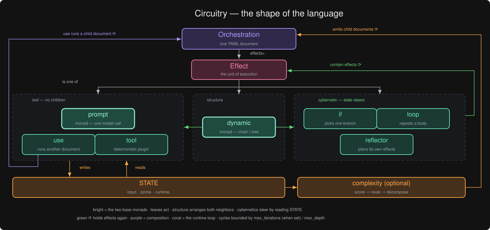

# Circuitry

[](https://pypi.org/project/circuitry-cof/)
[](https://github.com/kenankstipek/circuitry/actions/workflows/quality.yml)
[](https://github.com/kenankstipek/circuitry)
[](LICENSE)

**Circuitry** (`cof`, the **C**ybernetic **O**rchestration **F**ramework) is a YAML-first runtime for LLM pipelines that watch their own output and adapt. Loops decide whether to go again from what the model just produced, conditionals branch on it, and reflectors plan from it: a control loop around model calls, not a chain of fixed prompts. The design follows the cybernetics of [Gordon Pask](https://en.wikipedia.org/wiki/Gordon_Pask), effects in conversation with each other through a shared state.

> "Control mechanisms that lay their own plans." — Gordon Pask, *An Approach to Cybernetics* (1961)

The model can decide what happens next: which branch to take, whether to try again, what to plan next. But every run starts from the same place, can only go where you drew the paths, and records each decision at the same spot in the [shadow state](#shadow-state). Circuitry puts the nondeterministic parts of an agent inside a deterministic frame.

This page is the short tour. The **[Guidebook](docs/guidebook/README.md)** covers everything in fourteen chapters, also as a [PDF](docs/guidebook/circuitry-guidebook.pdf) and an [EPUB](docs/guidebook/circuitry-guidebook.epub).

## Install and run

```bash
curl -fsSL https://raw.githubusercontent.com/kenankstipek/circuitry/main/scripts/install.sh | sh   # or: pipx install circuitry-cof
cof setup                           # find a local model (Ollama by default) and write config
cof run learn/hello -e name=World   # run a bundled example
cof list                            # the bundled library: learn, utilities, patterns, recipes, agents
cof tui                             # or do all of it in the terminal UI
```

Hosted providers read their keys from the environment (`OPENAI_API_KEY`, `ANTHROPIC_API_KEY`, …); `cof doctor` shows what is reachable. [`config.example.json`](src/circuitry/bundled/examples/config.example.json) shows the documented config keys, and [`.env.example`](src/circuitry/bundled/examples/.env.example) lists every hosted adapter's and tool plugin's credential env var, with placeholder values, if you'd rather write the files by hand than run `cof setup`. Storage and observability runtime plugins (Postgres, Datadog, Sentry, …) have their own env vars, documented per plugin in [`docs/runtime-plugins.md`](docs/runtime-plugins.md).

## Your first orchestration

```yaml
# triage.yml
effects:
  - type: prompt
    name: kind
    template: "Is this issue a bug, a feature or a question? Answer with the one word, nothing else. Issue: {{input.issue}}"
  - type: prompt
    name: reply
    template: "Reply as the maintainer to whoever filed this issue (kind: {{prime.kind.value}}). Thank them and say what happens next. Two plain sentences, no subject line. Issue: {{input.issue}}"
```

```bash
cof check triage.yml
cof run triage.yml -e issue="parse_duration fails on 1h30m with ValueError: invalid duration. 90m works." --out run.json
```

## Shadow state

Every run builds a **shadow state**: a tree with the same keys as the orchestration, holding what each effect produced. The YAML fixes its shape before the run starts, and the run fills it in. For `triage.yml`, `run.json` holds:

```yaml
input:
  issue: "parse_duration fails on 1h30m with ValueError: invalid duration. 90m works."
prime:
  kind:
    value: Bug.
    meta: {adapter: ollama, model: ministral-3:3b, ...}
  reply:
    value: "Thank you for bringing this to our attention—I appreciate your patience as we investigate the issue. We’ll look into why `1h30m` fails while `90m` works correctly and will address it promptly in the next update."
    meta: {adapter: ollama, model: ministral-3:3b, prompt_sent: "Reply as the maintainer to whoever filed this issue (kind: Bug.). Thank them …", ...}
runtime:
  last_run: {...}
```

- **Same keys, as data.** An effect named `kind` lives at `prime.kind`; a `search` step inside a `context` dynamic at `prime.context.search`. A named loop adds one node per pass (`iter_0`, `iter_1`, …) plus `last`. Since every path is known from the YAML, any effect can read an earlier one: `{{prime.kind.value}}` in a template, `state.prime.kind.value != ""` in a condition ([CEL](https://github.com/google/cel-spec)).
- **Three roots.** `input` is what the caller passed, `prime` what the effects produced, `runtime` what the framework recorded.
- **The whole record.** Each node keeps its `value` and its `meta`: model, prompt, tokens, timings, errors, the branch taken. `--live-state` writes the shadow state as the run goes; `--out` saves the finished one.

## An agent that checks its own work

The triage above only talks. This agent acts: it runs the tests, then keeps asking the model for a patch, applying it and rerunning the tests until they pass, three passes at most.

```yaml
# fix.yml
effects:
  - type: tool
    name: tests
    provider: pytest
    params: {args: [-q], cwd: "{{input.repo}}", allow_nonzero: true}
  - type: loop                     # unnamed: each pass overwrites patch, apply and tests
    while: {mode: cel, expr: "state.prime.tests.meta.exit_code != 0"}
    max_iterations: 3
    body:
      - type: prompt
        name: patch
        template: |
          Write a unified diff that fixes this issue. Output only the diff.
          Issue: {{{input.issue}}}
          Test output: {{{prime.tests.value}}}
      - type: tool
        name: apply
        provider: git
        params: {args: [apply, "-"], cwd: "{{input.repo}}", stdin: "{{{prime.patch.value}}}\n"}
        on_error: skip             # a patch that doesn't apply costs a pass, not the run
      - type: tool
        name: tests
        provider: pytest
        params: {args: [-q], cwd: "{{input.repo}}", allow_nonzero: true}
```

```bash
cof run fix.yml -e repo=. -e issue="parse_duration fails on 1h30m"   # it edits files: use a branch
```

The model sees the real test output, and the loop's condition reads the latest test result from the shadow state to decide whether to go again. [Chapter 14](docs/guidebook/14-issue-to-pull-request.md) grows this into the whole agent: triage, context gathering, a plan, and a pull request.

## The language



Seven effects, in three kinds:

- **Leaves act:** `prompt` (one model call), `tool` (one plugin call: files, HTTP, ffmpeg, shell, MCP, …) and `use` (a child orchestration).
- **Structure composes:** `dynamic` runs effects in sequence (`chain`) or in parallel (`tree`).
- **Cybernetic effects steer:** `if`, `loop` and `reflector` read the shadow state and decide what runs next: a branch, another pass, a new plan.

Out of the box: 29 model providers (Ollama, llama.cpp and vLLM locally; OpenAI, Anthropic, Gemini and OpenRouter hosted) and 72 tool plugins (git, GitHub, files, HTTP, shell, pytest, ffmpeg, ImageMagick, MCP, …). Models, adapters, tools and limits live in config, not in the document, so the same orchestration runs against a local 8B model or a hosted one. An optional complexity layer scores each prompt, routes it to the cheapest capable model and splits what is too big.

## From Python, or from Claude

```python
from circuitry import run_orchestration

result = run_orchestration(orchestration_path="triage.yml", state={"issue": "parse_duration fails on 1h30m"})
print(result.ok, result.state["prime"]["reply"]["value"])
```

`circuitry-mcp` serves the same runtime over MCP, so a Claude Code or Claude Desktop session can run an orchestration and act as its model. See [Surfaces](docs/guidebook/12-surfaces.md).

## Read next

| | |
| --- | --- |
| [Guidebook](docs/guidebook/README.md) | every primitive in three acts: [Basics](docs/guidebook/README.md#part-i--basics-the-machine), [Cybernetics](docs/guidebook/README.md#part-ii--cybernetics-the-machine-steering-itself), [The machine in the world](docs/guidebook/README.md#part-iii--the-machine-in-the-world) |
| [Orchestration reference](docs/orchestration-reference.md) | every field of every effect |
| [Grammar](docs/guidebook/grammar.md) | the formal grammar |
| [Architecture](docs/architecture.md) | how it is built, design principles, and where the code lives |
| [docs/index.md](docs/index.md) | everything else: routing, profiles, the TUI, plugins, persistence, security |

## Project

Circuitry is `0.x` alpha: a minor version may break things, and [`CHANGELOG.md`](CHANGELOG.md) says so when it does; [`docs/stability.md`](docs/stability.md) lists what is public. It collects no telemetry and calls only the model, tool and storage services you configure ([`SECURITY.md`](SECURITY.md), [threat model](docs/threat-model.md)). Questions go to [Discussions](https://github.com/kenankstipek/circuitry/discussions), bugs and ideas to [Issues](https://github.com/kenankstipek/circuitry/issues), and [`CONTRIBUTING.md`](CONTRIBUTING.md) covers development. MIT licensed.
